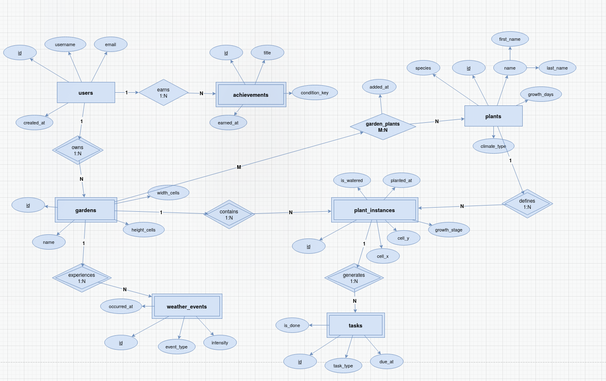
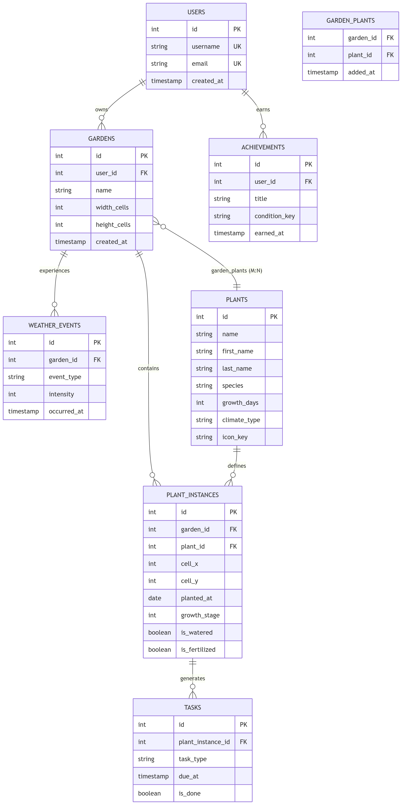

# Garden Game - Database Design

Концептуальна та логічна схема бази даних для гри "Garden Game".

## 📊 Діаграми

### Концептуальна схема (Chen)


### Логічна схема (Crow's Foot)


## 📋 Сутності

| Сутність | Тип | Опис |
|----------|-----|------|
| users | Independent Entity | Гравці системи |
| gardens | Weak Entity | Сади гравців |
| plants | Independent Entity | Довідник видів рослин |
| plant_instances | Weak Entity | Конкретні рослини в садах |
| tasks | Weak Entity | Завдання по догляду |
| weather_events | Weak Entity | Погодні події |
| achievements | Weak Entity | Досягнення гравців |

## 🔗 Зв'язки

- `users` → `gardens` (1:N)
- `users` → `achievements` (1:N)
- `gardens` → `plant_instances` (1:N)
- `gardens` → `weather_events` (1:N)
- `plants` → `plant_instances` (1:N)
- `plant_instances` → `tasks` (1:N)
- `gardens` ↔ `plants` (M:N via garden_plants)

## 📁 Файли

- `DDL.sql` - Структура таблиць (SQLite)
- `DML.sql` - Приклади запитів
- `example/Chen/garden_chen.xml` - Chen діаграма
- `example/Crow/garden_crow_diagram.mmd` - Crow діаграма

## 🗄️ Нормалізація

Всі таблиці в **3NF**:
- ✅ 1NF - атомарні атрибути
- ✅ 2NF - немає часткових залежностей
- ✅ 3NF - немає транзитивних залежностей

## 🔧 Використання

```bash
# Створити БД
sqlite3 garden_game.db < DDL.sql

# Заповнити дані
sqlite3 garden_game.db < DML.sql
```

## 📝 Класифікація таблиць

### Independent Entities
- **users** - 3NF, Entity Table
- **plants** - 3NF, Entity Table (Reference Data)

### Weak Entities
- **gardens** - 3NF, залежить від users
- **plant_instances** - 3NF, залежить від gardens & plants
- **tasks** - 3NF, залежить від plant_instances
- **weather_events** - 3NF, залежить від gardens
- **achievements** - 3NF, залежить від users

### Junction Table
- **garden_plants** - 3NF, Associative Entity (M:N)

## 📚 Посилання

- [Концептуальне моделювання](https://kostyl.dev/java/pr2/conceptual-modeling)
- [Нормалізація](https://kostyl.dev/java/pr2/normalization)
- [Класифікація таблиць](https://kostyl.dev/java/pr2/table-classification)
- [Логічне моделювання](https://kostyl.dev/java/pr2/logical-modeling)
- [Фізична схема](https://kostyl.dev/java/pr2/physical-schema)

---